# Connect Saas说明文档

## 介绍
Connect使用了微服务解决方案，如未指明，都是C#写成：
+ 网页服务/文件存储使用AWS的S3
+ 基本每个服务都有自己单独的PostgreSQL数据库
+ 使用Redis做分布式缓存
+ 使用RabbitMQ做服务间的消息传递.
+ 使用 Docker 来部署&运行所有的服务和应用程序.
+ 使用Keycloak作为SSO
+ 使用Business Event Log来记录服务端日志
+ 使用Entity Store来保存活动信息
+ [消息服务](###message-server)用来处理定时/即时发送消息到WhatApp的逻辑，根据发送消息的状态更新活动的状态
+ [Facebook服务](###facebook-server)作为Facebook App的服务器端，充当聊天机器人
+ [WhatsApp服务](###whatsapp-server)用来发送消息到WhatsApp用户，并接受WhatsApp的webhook来更新发送状态
+ [Leads服务](###leads-server)目前只是保存Leads的个人资料，并可以给Leads打标签。目前发送WhatsApp消息后，接受者的个人资料作为Leads被保存到这里
+ 数据处理服务是Python写成。定时跑脚本来从各个服务的数据库取数据，处理后生成需要的报表数据，或者跑一些定时任务：例如给指定Leads打标签,根据数据生成excel报表发送文件到邮件或SFTP.没有复杂的逻辑，只是些数据查询然后处理的的脚本
+ [报表服务](###report-server)用来提供报表的各种图形化数据查询，报表数据是数据处理服务脚本跑完后的数据,
+ [媒体服务](###media-server)用来管理用户上传的图片/视频/音频文件，设计为按存储大小收费，目前还未收费。需要批量移动/删除文件
+ [自由活动服务](###custom-campaign-server)可以让用户自己设计可以直接发给用户浏览的各种内容的静态网页，有可能需要引导用户登录，并记录用户行为，来得到用户画像
+ [文件上传服务](###file-upload-service)用来让用户上传图片/视频/音频文件到AWS的S3，上传后提供公共浏览，文件大小可能达到2G
+ [抖音服务](###tiktok-server)用来管理抖音使用的视频

下图展示了该系统:
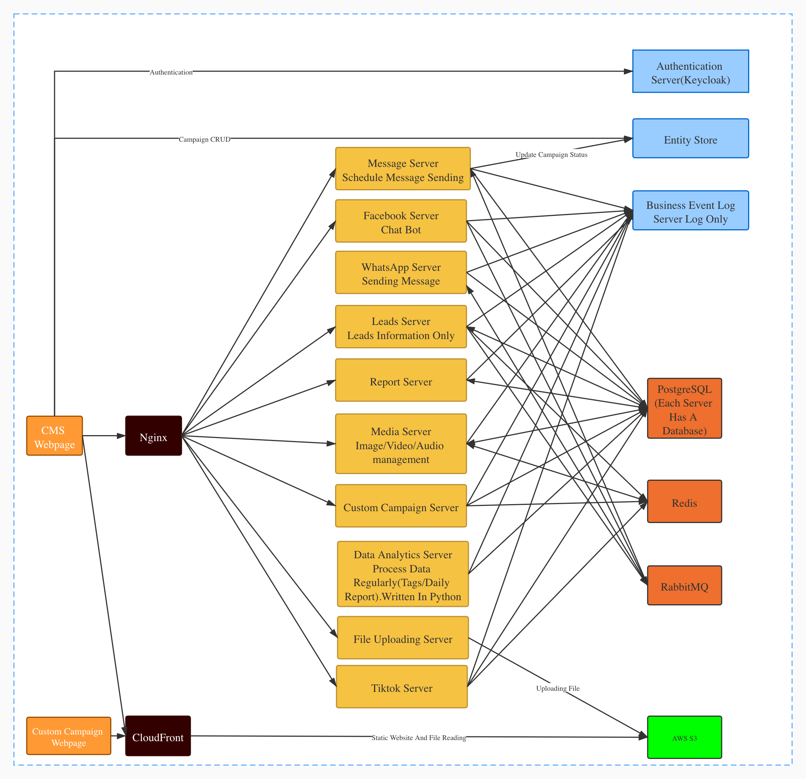

## 下面展示各个服务的类图和数据结构，如果有复杂逻辑，加上时序图

### **message-server**
* 需求:
     * 消息模版（Message Templates）申请
         * 查看已申请的消息模版
         * 删除已申请的消息模版
         * 新增模版申请
             * 设置模版参数
             * 设置抬头图片
             * 发送测试消息         
     * 活动管理
         * 选择活动消息发送渠道（短信，Messager，WhatsApp）
         * 发送SMS渠道的One-Time消息
             * 上传接收人CSV文件
             * 发送测试短信
             * 设置发送计划
             * 立即发送             
         * 发送WhatsApp渠道的One-Time消息
             * 上传接收人CSV文件
             * 选择消息模版
         * 发送SMS渠道的Automated消息
             * 选择活动模版（Campaign Template）
             * 上传接收人CSV文件
             * 编辑活动消息项的SMS内容
         * 发送WhatsApp渠道的Automated消息
             * 选择活动模版（Campaign Template）
             * 上传接收人CSV文件
 * 运营管理端（暂未计划，但将来应该需要）
     * 消息模版（Message Template）审核
         * 审核模版
     * 活动模版管理
         * 添加活动模版
         * 编辑活动模版
##### 类图

#### 数据库设计
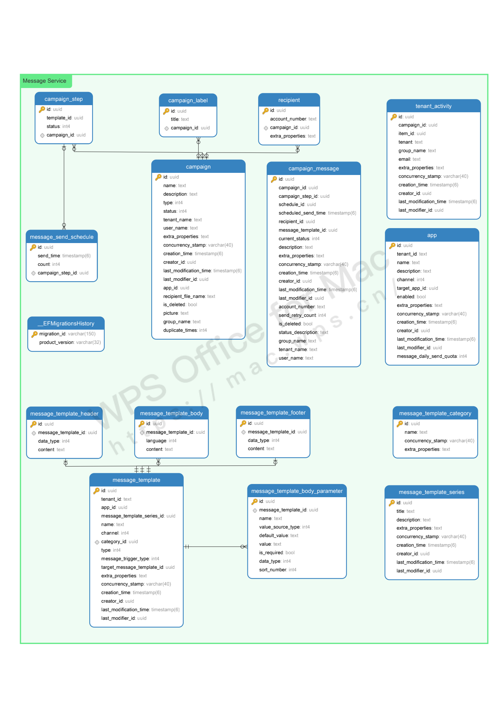

#### 注册新APP

#### 批准APP
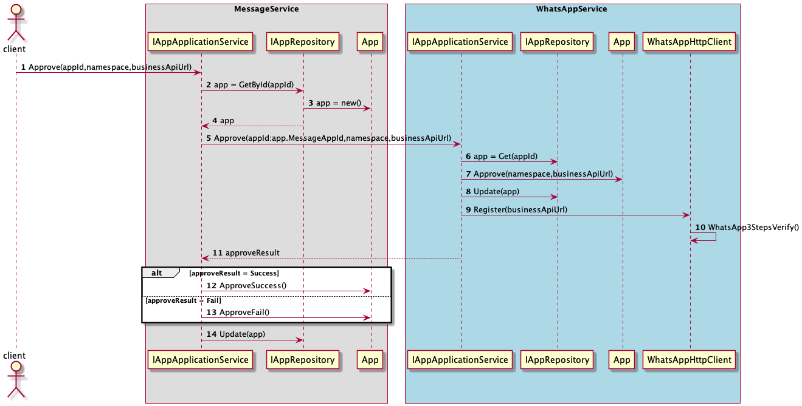

#### 产生活动消息
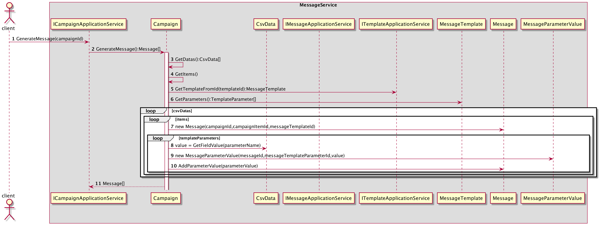

#### 发送消息

### **facebook-server**
* 需求：
  * 根据配置做聊天机器人。
  
#### 类图
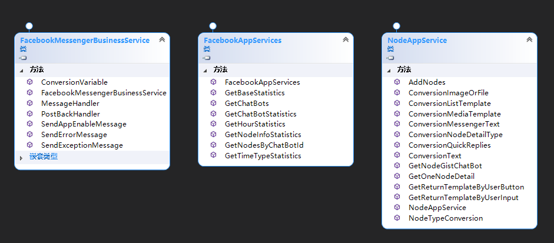    

#### 数据库设计
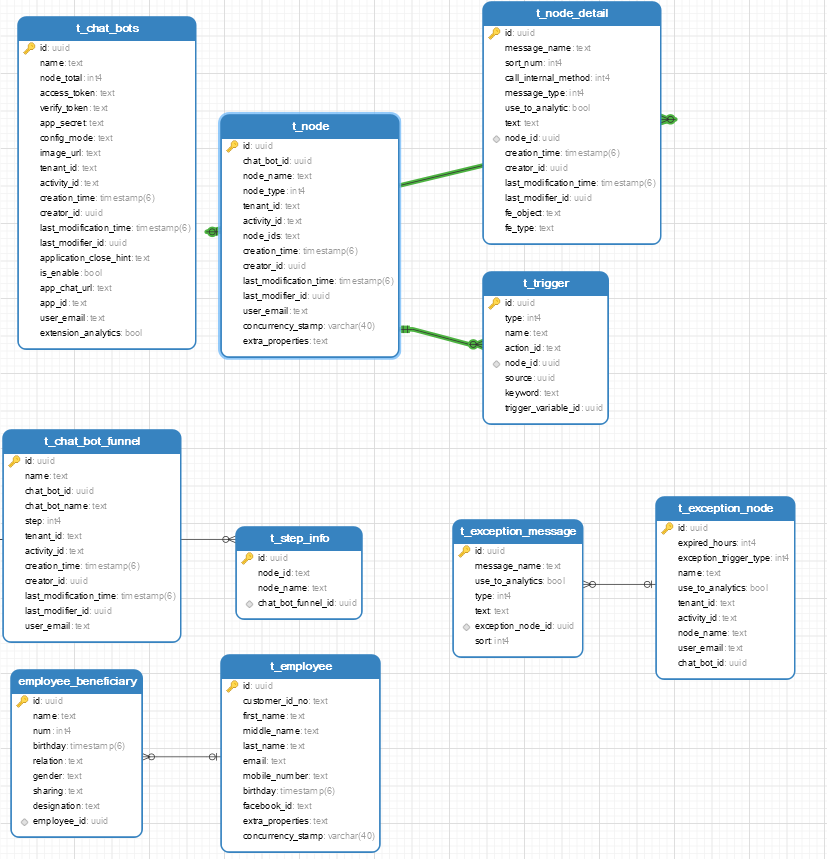    

#### 机器人响应facebook用户输入时序图
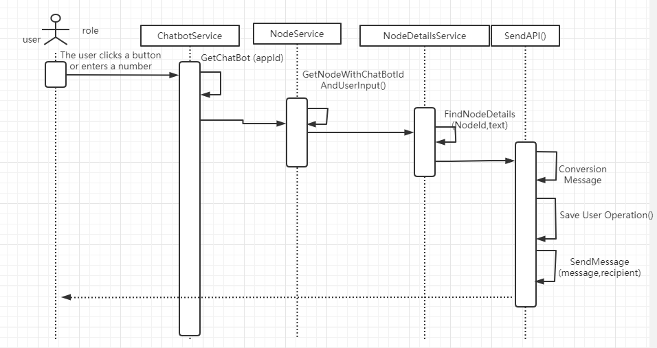    

### **whatsapp-server**
* 需求:
  发送WhatsApp消息
#### WhatsApp Service Domain
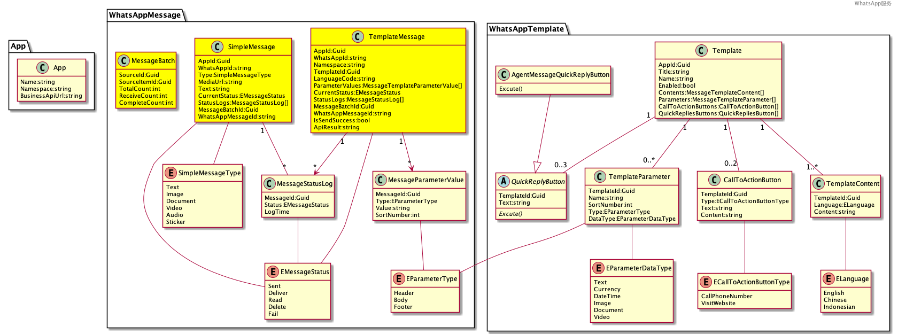

#### WhatsApp Service Application Service

#### WhatsApp Service Database Design
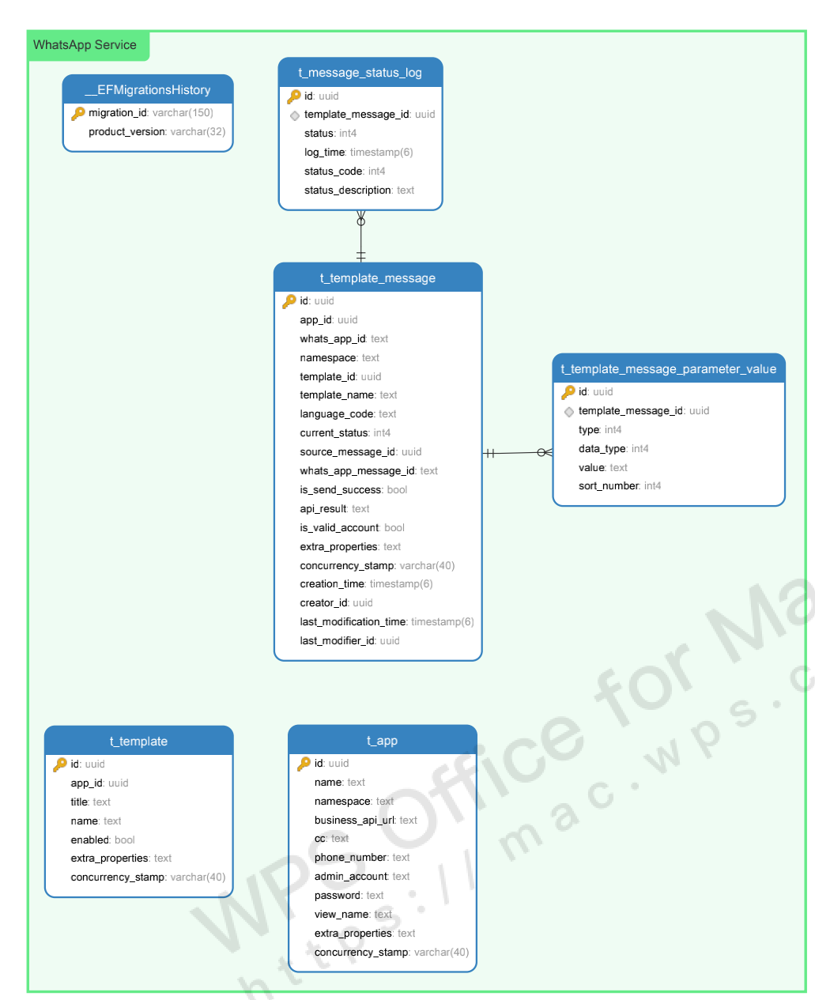

### **report-server**

#### 需求：
  * WhatsApp/Facebook/Leads报表需要提供的各个API

#### 类图
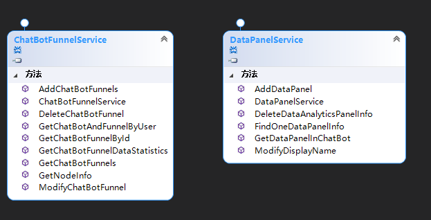
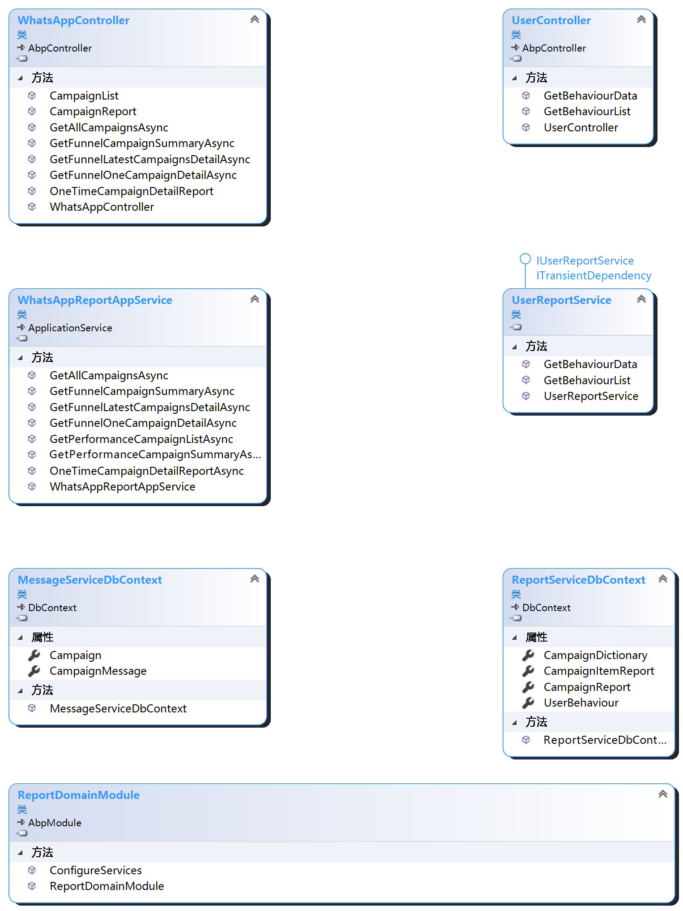

#### 数据库设计
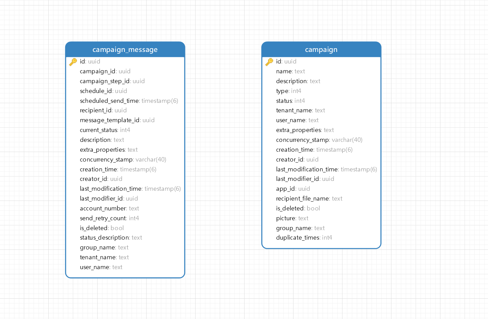

### **leads-server**
#### [需求](https://www.figma.com/file/ty4OWuALBZ6dP92eufO7U3/Coherent-Connect(New)?node-id=1571%3A13449)
* 用户
    * 添加用户：新用户直接入库，如果已存在并且渠道不一致，新增该用户的渠道信息。
    * 用户列表：
      * 可按照登录用户权限，查询相应的用户信息。
      * 按照筛选条件导出用户文件。
      * 批量选择用户，加入黑名单。
    * 用户详情：
      * 可查看用户具体信息，开通渠道，可能认识的人，用户行为日志。
* 黑名单
    * 黑名单列表：可供查询的列表，并可移出用户。
* 标签
    * 标签列表：提供列表，详情，编辑标签功能。
    * 默认标签：系统提供一套默认标签，添加用户时，自动打上标签。
    * 手动标签：该标签，由客户手动选一批数据，打标签。
    * 自动标签：可以设置一些规则，符合该规则的用户，在指定时间自动打上标签。
* 标签组
    * 标签组列表
#### 类图
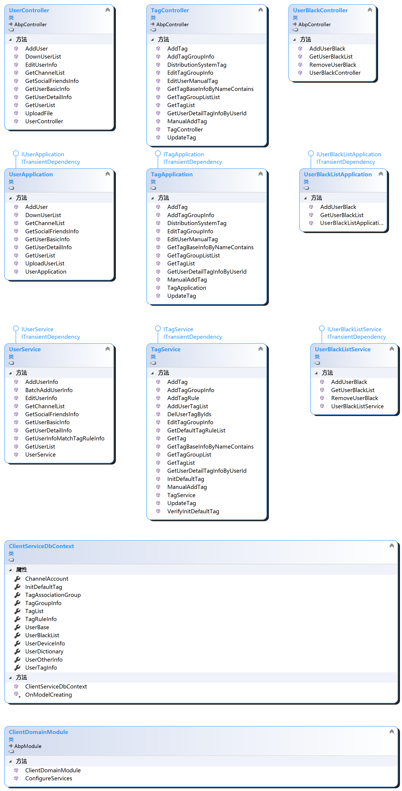    
  
#### 数据库设计
- 用户表
    

- 标签表
- 

#### 时序图    
- 新增用户
- 

### **media-server**
#### 需求
*   提供图片，视频，音频等数据存储
*   提供数据分组功能，并可以对分组操作，例如：一千张图片改名/移动到另一个组
*   对不同商户存储大小限制
*   一个文件最大2G
*   可能有CDN需要

#### 类图
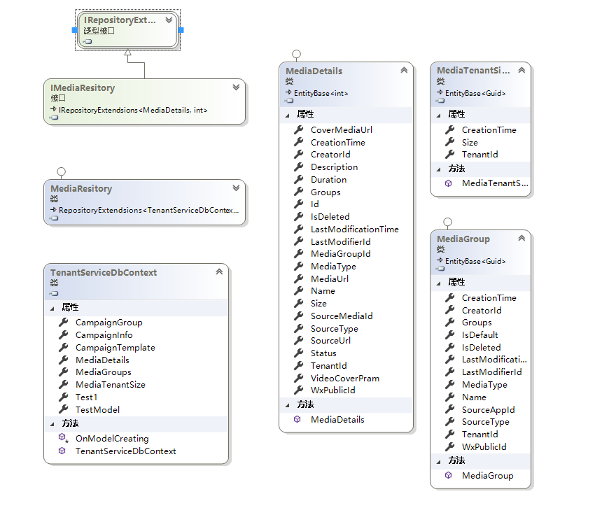
#### 数据库设计

#### 文件上传后记录文件信息的时序图

### **custom-campaign-server**

#### 需求
*   提供活动/活动模板创建，查询等功能
*   提供页面 给facebook twitter 抓取概览信息 

#### 类图

#### 数据库设计
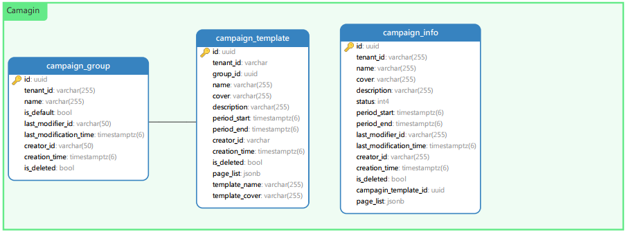

### **file-upload-server**
#### 需求
*   将接收的文件流传到 aws s3 上
*   一个文件最大2G

#### 类图
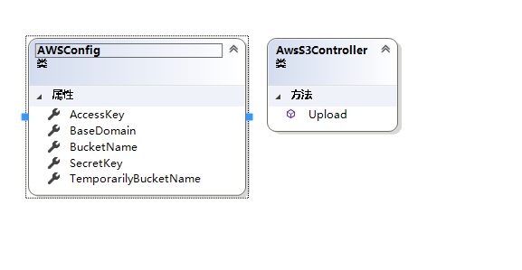

### **tiktok-server**
#### 需求
*   添加视频 并同步到对应抖音号
*   同步抖音号视频（包含 视频，点赞，观看，等数据）

#### 抖音接口基础类图

#### 数据访问层类图
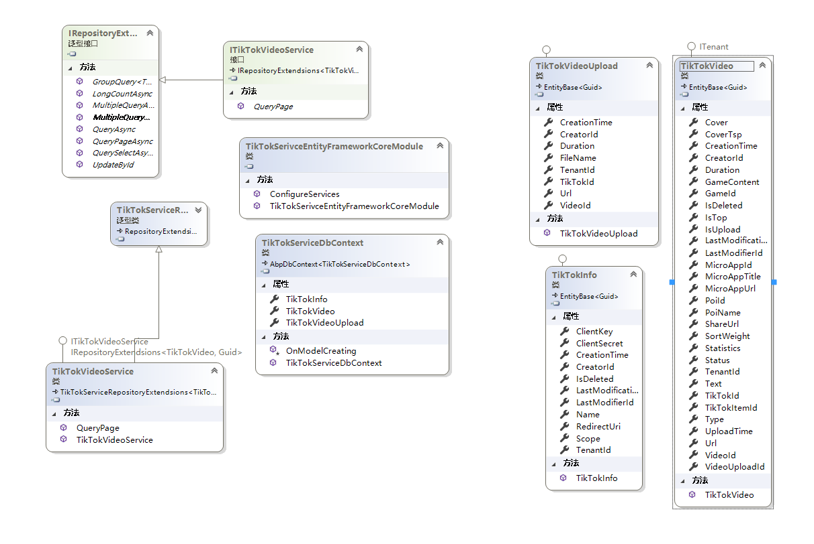

#### 数据库设计

#### 数据同步时序图
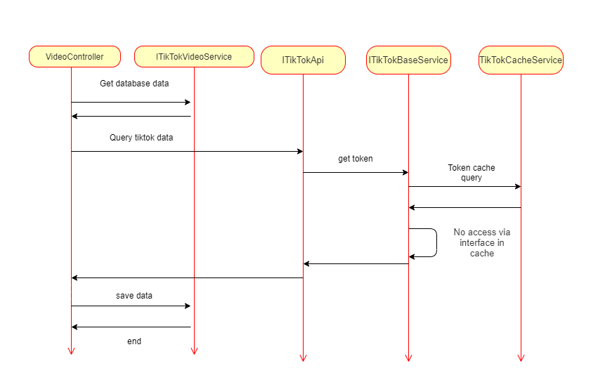