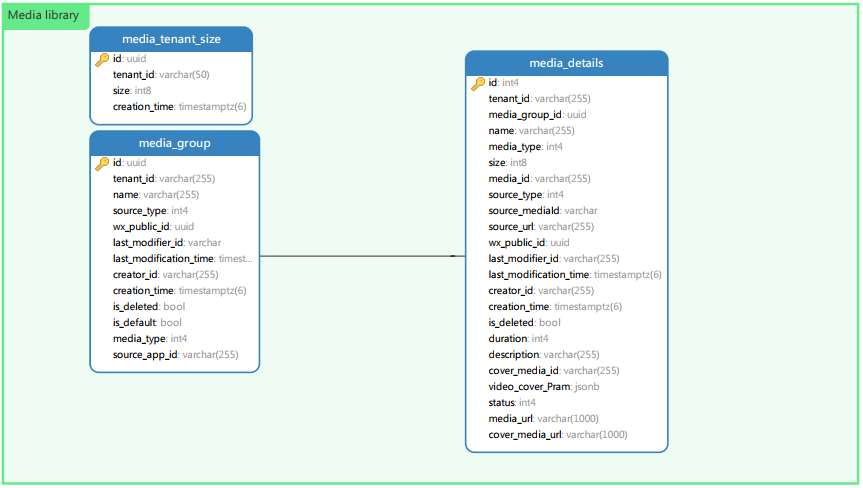

# Connect Saas documentation

## Introduction
Connect uses a microservice solution, if not specified, it is written in C#:
+ Web service/file storage uses AWS S3
+ Basically each service has its own separate PostgreSQL database
+ Use Redis for distributed cache
+ Use RabbitMQ for messaging between services.
+ Use Docker to deploy & run all services and applications.
+ Use Keycloak as SSO
+ Use Business Event Log to record server-side logs
+ Use Entity Store to save campaign information
+ [Message Server](###message-server) is used to process the logic of sending messages to WhatApp regularly/instantly, and update the status of the activity according to the status of the message sent
+ [Facebook Server](###facebook-server) as the server side of Facebook App, acting as a chatbot
+ [WhatsApp server](###whatsapp-server) is used to send messages to WhatsApp users and accept WhatsApp webhook to update the sending status
+ [Leads server](###leads-server) currently only saves the personal information of Leads from campaigns, and can tag Leads. After sending a WhatsApp message, the recipient’s personal information is saved here as Leads
+ The data analytics server is written in Python. Regularly run scripts to fetch data from the database of each service, generate the required report data after processing, or run some timing tasks: such as tagging the specified Leads, generating excel reports based on the data and sending files to user's email or SFTP. There is no complicated logic, Just some data query and then processed script
+ [Report Server](###report-server) is used to provide various graphical data queries of reports. The report data is the data after the data analytics server script is run.
+ [Media Server](###media-server) is used to manage the pictures/video/audio files uploaded by users. It is designed to be charged according to the storage size. Currently, there is no charge. Need to move/delete files in bulk
+ [custom campaign Server](###custom-campaign-server) allows users to design static web pages that can be directly sent to users to browse various content without any code. It may be necessary to guide users to log in and record user behaviors to obtain users portrait
+ [File upload service](###file-upload-service) is used to allow users to upload picture/video/audio files to S3 of AWS, after uploading to provide public browsing, the file size may reach 2G.And CDN may be needed.
+ [Tiktok Service](###tiktok-server) is used to manage the videos used by Tiktok and needs some webhook APIs.

The following figure shows the system:

## The following shows the class diagram and data structure of each service. If there is complex logic, add a sequence diagram

### **message-server**
* Requirement:
     * Application for Message Templates
         * View the applied message template
         * Delete the applied message template
         * New template application
             * Set template parameters
             * Set header image
             * Send test message
     * Campaign management
         * Choose the campaign message sending channel (SMS, Messager, WhatsApp)
         * Send One-Time messages through SMS channels
             * Upload the recipient's CSV file
             * Send test SMS
             * Set delivery schedule
             * send immediately
         * Send One-Time messages from WhatsApp channel
             * Upload the recipient's CSV file
             * Choose a message template
         * Send Automated messages from SMS channels
             * Select Campaign Template (Campaign Template)
             * Upload the recipient's CSV file
             * Edit the SMS content of the event message item
         * Send Automated messages from WhatsApp channel
             * Select Campaign Template (Campaign Template)
             * Upload the recipient's CSV file
 * Operation management terminal (not planned yet, but should be needed in the future)
     * Message Template review
         * Review template
     * Campaign template management
         * Add campaign template
         * Edit campaign template
##### Class Diagram

#### Database Design

#### Sequence Diagram
##### Register a new app

##### Approve APP

##### Generate event messages

##### send messages

### **facebook-server**
* Requirements:
  * Make a facebook chat robot according to the configuration.
  
#### Class Diagram

#### Database Design

#### Sequence diagram of robot responding to facebook user input

### **whatsapp-server**
* Requirement:
  Send WhatsApp message
#### WhatsApp Service Domain

#### WhatsApp Service Application Service

#### WhatsApp Service Database Design

### **report-server**

#### Requirements:
  * Various APIs required for WhatsApp/Facebook/Leads reports

#### Class Diagram

#### Database Design

### **leads-server**
#### Requirements
* User
    * Add user: The new user is directly stored in the database. If it already exists and the channel is inconsistent, add the user's channel information.
    * User list:
      * You can query the corresponding user information according to the login user authority.
      * Export user files according to filter conditions.
      * Select users in batches and add them to the blacklist.
    * User details:
      * You can view user specific information, open channels, people you may know, and user behavior logs.
* Blacklist
    * Blacklist list: a list available for query, and users can be removed.
* Tag
    * Tag list: provide list, details, and edit tag functions.
    * Default tags: The system provides a set of default tags. When adding a user, the tags are automatically marked.
    * Manual tags: the customer manually selects a batch of leads and makes a tag.
    * Automatic tags: You can set some rules, and users who meet the rules will be automatically tagged at the specified time.
* Tag group
    * List of tag groups
#### Class Diagram

  
#### Database Design
- user table

-Tag table
-

#### Sequence diagram
##### New users
-

### **media-server**
#### Requirement
* Manage pictures, videos, audios, etc.
* Provide data grouping function, and can group operations, for example: rename/move a thousand pictures to another group
* Storage size limit for different merchants
* The maximum size of a file is 2G
* CDN may be required

#### Class Diagram

#### Database Design

#### Timing diagram of recording file information after file upload

### **custom-campaign-server**

#### Requirement
* User can make a static webpage with URL to show to leads without any code
* Provide events/event template creation, query and other functions
* Provide a page to fetch overview information for facebook twitter

#### Class Diagram

#### Database Design

### **file-upload-server**
#### Requirement
* Stream the received files to aws s3
* The maximum size of a file is 2G

#### Class Diagram

### **tiktok-server**
#### Requirement
* Add video and sync to the corresponding Tiktok ID
* Synchronize TikTok video (including video, like, watch, and other data)

#### TikTok interface basic class diagram

#### Data access layer class diagram

#### Database Design

#### Data synchronization timing diagram
